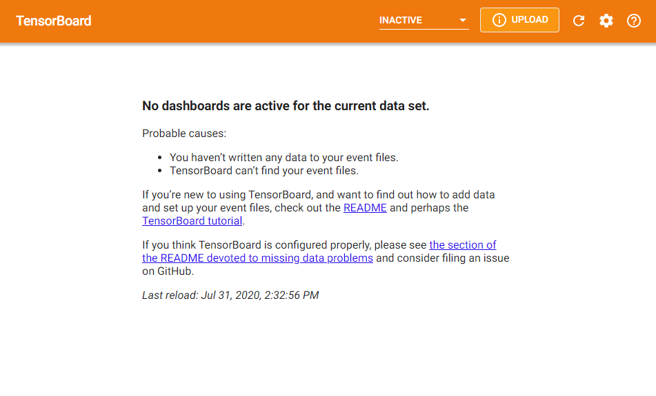
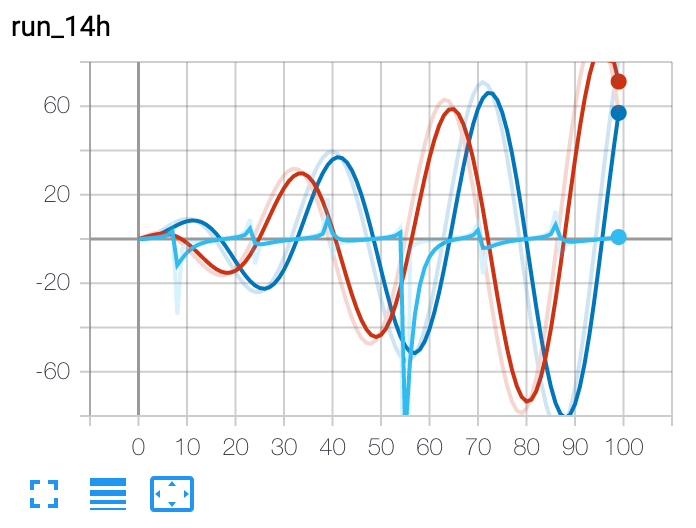
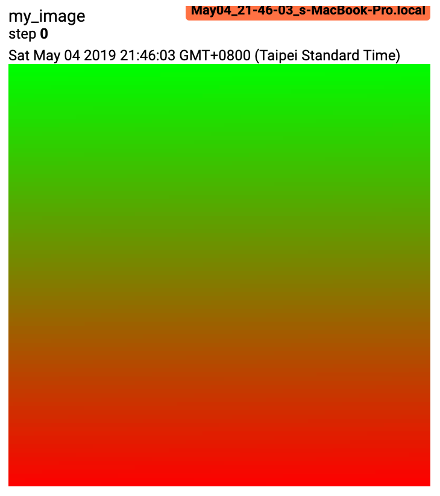
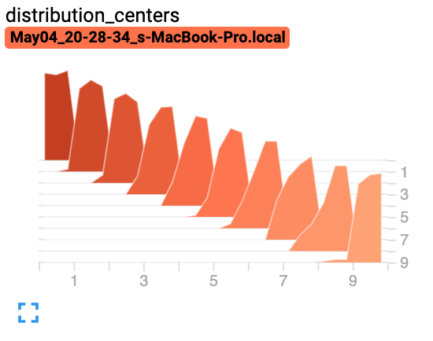
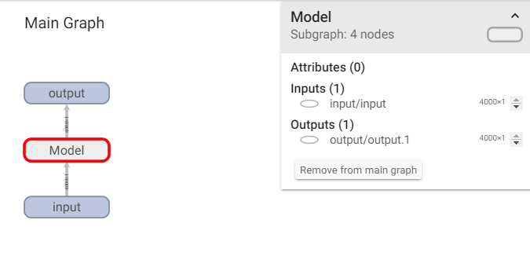
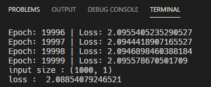
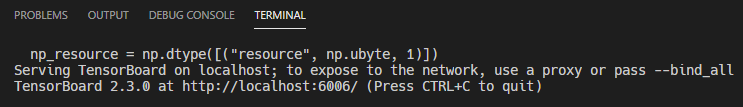
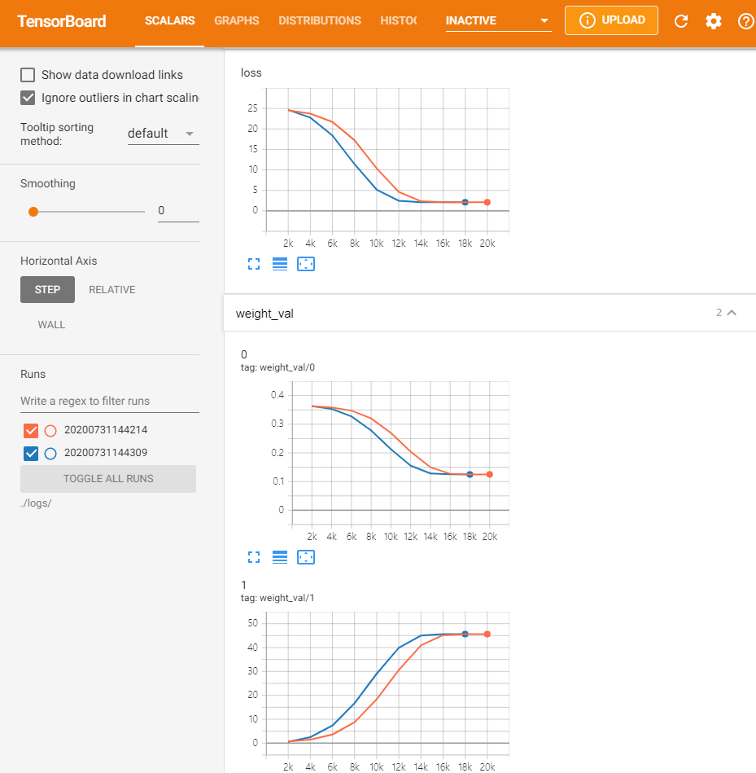
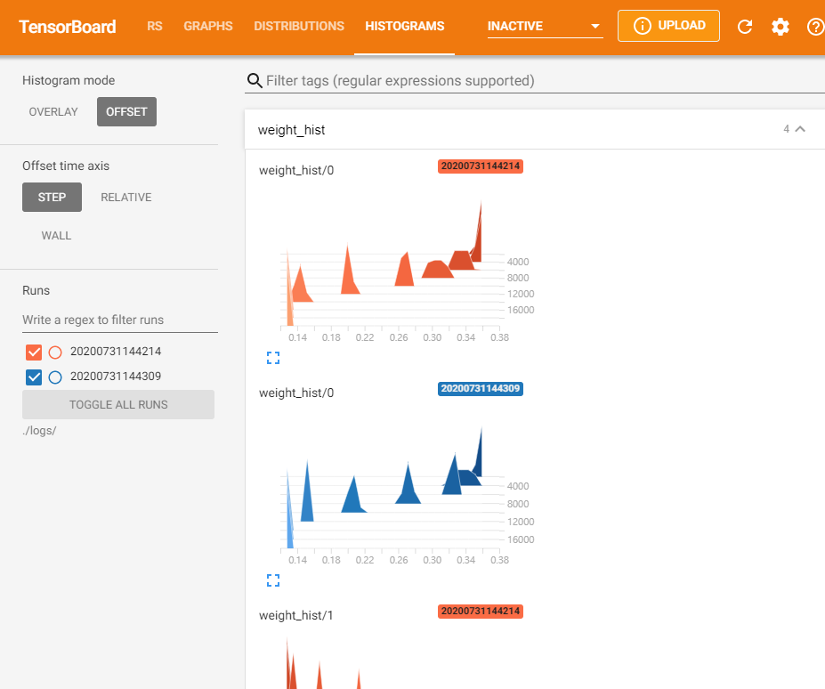

# Tensorboard with PyTorch

Created: Jul 31, 2020 2:13 PM
Last Edited Time: Jul 31, 2020 2:49 PM

# Overview

- Enviroment
    - Intall
- Basic Settings
    - Logs Dir Structure
    - Init Code
    - Execution
- Functions
- Practice

## Enviroment

```python
pip install torch
```

```python
pip install tensorboard
```

## Basic Settings

### Log Directory

**Recommend** 

./log_dir/timestamp

**Expected Structure** 

./log_dir

- /202012312020
- /202012312035
- /...

### Init Code

We can save data through "SummaryWriter" Class

```python
import datetime
import torch

# format : 202012311224
timestamp = datetime.datetime.today().strftime('%Y%m%d%H%M%S') 
log_dir = "./log_dir/{}".format(timestamp)
# dir is generated automatically
writer = SummaryWriter(log_dir)
```

### Execution

```python
terminal 
> tensorboard --logdir=./log_dir/
```

```python
TensorBoard 2.3.0 at http://localhost:6006/ (Press CTRL+C to quit)
```

*Ports can be different, follow terminal's result



*No information is displayed because the model has not been trained.

## Functions

[https://pytorch.org/docs/stable/tensorboard.html](https://pytorch.org/docs/stable/tensorboard.html)

1. Scalar

    ```python
    writer.add_scalar('name', value, epoch)
    ```

    

2. Image

    ```python
    writer.add_image('name', img[][])
    ```

    

3. Histogram

    ```python
    writer.add_histogram('name', weight, epoch)
    ```

    

4. Graph

    ```python
    writer.add_graph('name', model)
    ```

    

## Practice

[https://github.com/chjinny/tensorboard_torch](https://github.com/chjinny/tensorboard_torch)

```python
terminal 1 : training
> app.py

terminal 2 : tensor board
> tensorboard --logdir=./logs/
```

### Result

**Terminal 1**



**Terminal 2**



**Tensorboard** (http://localhost:port)

- Scalar

    

- Histogram

    

## Refs

https://tutorials.pytorch.kr/intermediate/tensorboard_tutorial.html

https://seongkyun.github.io/others/2019/05/11/pytorch_tensorboard/

https://pytorch.org/docs/stable/tensorboard.html

https://keep-steady.tistory.com/14

https://medium.com/trackin-datalabs/tensorboard-%EA%B0%84%EB%8B%A8%ED%9E%88-%EC%8B%9C%EC%9E%91%ED%95%98%EA%B8%B0-18a4fda2efb1

https://wikidocs.net/45115